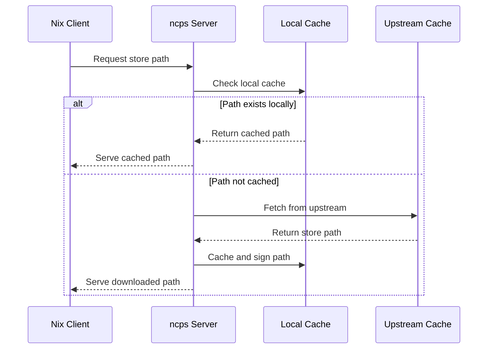

# 🚀 ncps: Nix Cache Proxy Server

> A high-performance proxy server that accelerates Nix dependency retrieval across your local network by caching and serving packages locally.

[](https://goreportcard.com/report/github.com/kalbasit/ncps)
[](https://opensource.org/licenses/MIT)

## 📋 Table of Contents

- [Overview](#-overview)
- [Problem & Solution](#-problem--solution)
- [Key Features](#-key-features)
- [How It Works](#-how-it-works)
- [Quick Start](#-quick-start)
- [Installation](#-installation)
- [Configuration](#-configuration)
- [Client Setup](#-client-setup)
- [Troubleshooting](#-troubleshooting)
- [Contributing](#-contributing)

## 🎯 Overview

ncps acts as a local binary cache for Nix, fetching store paths from upstream caches (like cache.nixos.org) and storing them locally. This reduces download times and bandwidth usage, especially beneficial when multiple machines share the same dependencies.

## 🔍 Problem & Solution

### The Problem

When multiple machines running NixOS or Nix pull packages, they often download the same dependencies from remote caches, leading to:

- ❌ **Redundant downloads** - Each machine downloads identical files
- ❌ **High bandwidth usage** - Significant network traffic for large projects
- ❌ **Slower build times** - Network latency impacts development velocity

### The Solution

ncps solves these issues by acting as a **centralized cache** on your local network, dramatically reducing redundant downloads and improving build performance.

## ✨ Key Features

| Feature | Description |
| ----------------------- | -------------------------------------------------- |
| 🚀 **Easy Setup** | Simple configuration and deployment |
| 🔄 **Multi-Upstream** | Support for multiple upstream caches with failover |
| 💾 **Smart Caching** | LRU cache management with configurable size limits |
| 🔐 **Secure Signing** | Signs cached paths with private keys for integrity |
| 📊 **Monitoring** | OpenTelemetry support for centralized logging |
| 🗜️ **Compression** | Harmonia's transparent zstd compression support |
| 💾 **Embedded Storage** | Built-in SQLite database for easy deployment |

## ⚙️ How It Works



1. **Request** - Nix client requests a store path from ncps
1. **Cache Check** - ncps checks if the path exists in local cache
1. **Upstream Fetch** - If not cached, fetches from configured upstream caches
1. **Cache & Sign** - Stores and signs the path with ncps private key
1. **Serve** - Delivers the path to the requesting client

## 🚀 Quick Start

Get ncps running quickly with Docker:

```bash
# Pull the images
docker pull alpine
docker pull kalbasit/ncps

# Create the storage volume
docker volume create ncps-storage
docker run --rm -v ncps-storage:/storage alpine /bin/sh -c \
  "mkdir -m 0755 -p /storage/var && mkdir -m 0700 -p /storage/var/ncps && mkdir -m 0700 -p /storage/var/ncps/db"

# Initialize database
docker run --rm -v ncps-storage:/storage kalbasit/ncps /bin/dbmate --url=sqlite:/storage/var/ncps/db/db.sqlite migrate up

# Start the server
docker run -d --name ncps -p 8501:8501 -v ncps-storage:/storage kalbasit/ncps \
  /bin/ncps serve \
  --cache-hostname=your-ncps-hostname \
  --cache-storage-local=/storage \
  --cache-database-url=sqlite:/storage/var/ncps/db/db.sqlite \
  --upstream-cache=https://cache.nixos.org \
  --upstream-public-key=cache.nixos.org-1:6NCHdD59X431o0gWypbMrAURkbJ16ZPMQFGspcDShjY=
```

Your cache will be available at `http://localhost:8501` and the public key at `http://localhost:8501/pubkey`.

## 📦 Installation

<details>
<summary><strong>🐳 Docker</strong></summary>

### Docker Setup

**Step 1:** Pull the image

```bash
docker pull kalbasit/ncps
```

**Step 2:** Initialize storage and database

```bash
docker volume create ncps-storage

docker run --rm -v ncps-storage:/storage alpine /bin/sh -c \
  "mkdir -m 0755 -p /storage/var && mkdir -m 0700 -p /storage/var/ncps && mkdir -m 0700 -p /storage/var/ncps/db"

docker run --rm -v ncps-storage:/storage kalbasit/ncps /bin/dbmate --url=sqlite:/storage/var/ncps/db/db.sqlite migrate up
```

**Step 3:** Start the server

```bash
docker run -d \
  --name ncps \
  -p 8501:8501 \
  -v ncps-storage:/storage \
  kalbasit/ncps \
  /bin/ncps serve \
  --cache-hostname=your-ncps-hostname \
  --cache-storage-local=/storage \
  --cache-database-url=sqlite:/storage/var/ncps/db/db.sqlite \
  --upstream-cache=https://cache.nixos.org \
  --upstream-cache=https://nix-community.cachix.org \
  --upstream-public-key=cache.nixos.org-1:6NCHdD59X431o0gWypbMrAURkbJ16ZPMQFGspcDShjY= \
  --upstream-public-key=nix-community.cachix.org-1:mB9FSh9qf2dCimDSUo8Zy7bkq5CX+/rkCWyvRCYg3Fs=
```

</details>

<details>
<summary><strong>🐳 Docker Compose</strong></summary>

Create a `docker-compose.yml` file:

```yaml
services:
  create-directories:
    image: alpine:latest
    volumes:
      - ncps-storage:/storage
    command: >
      /bin/sh -c "
        mkdir -m 0755 -p /storage/var &&
        mkdir -m 0700 -p /storage/var/ncps &&
        mkdir -m 0700 -p /storage/var/ncps/db
      "
    restart: "no"

  migrate-database:
    image: kalbasit/ncps:latest
    depends_on:
      create-directories:
        condition: service_completed_successfully
    volumes:
      - ncps-storage:/storage
    command: >
      /bin/dbmate --url=sqlite:/storage/var/ncps/db/db.sqlite migrate up
    restart: "no"

  ncps:
    image: kalbasit/ncps:latest
    depends_on:
      migrate-database:
        condition: service_completed_successfully
    ports:
      - "8501:8501"
    volumes:
      - ncps-storage:/storage
    command: >
      /bin/ncps serve
      --cache-hostname=your-ncps-hostname
      --cache-storage-local=/storage
      --cache-database-url=sqlite:/storage/var/ncps/db/db.sqlite
      --upstream-cache=https://cache.nixos.org
      --upstream-cache=https://nix-community.cachix.org
      --upstream-public-key=cache.nixos.org-1:6NCHdD59X431o0gWypbMrAURkbJ16ZPMQFGspcDShjY=
      --upstream-public-key=nix-community.cachix.org-1:mB9FSh9qf2dCimDSUo8Zy7bkq5CX+/rkCWyvRCYg3Fs=
    restart: unless-stopped

volumes:
  ncps-storage:
```

Then run:

```bash
docker compose up -d
```

</details>

<details>
<summary><strong>☸️ Kubernetes</strong></summary>

<details>
<summary>PersistentVolumeClaim</summary>

```yaml
apiVersion: v1
kind: PersistentVolumeClaim
metadata:
  name: ncps
  labels:
    app: ncps
    tier: proxy
spec:
  accessModes:
    - ReadWriteOnce
  resources:
    requests:
      storage: 20Gi
```

</details>

<details>
<summary>StatefulSet</summary>

```yaml
apiVersion: apps/v1
kind: StatefulSet
metadata:
  name: ncps
  labels:
    app: ncps
    tier: proxy
spec:
  replicas: 1
  selector:
    matchLabels:
      app: ncps
      tier: proxy
  template:
    metadata:
      labels:
        app: ncps
        tier: proxy
    spec:
      initContainers:
        - image: alpine:latest
          name: create-directories
          args:
            - /bin/sh
            - -c
            - "mkdir -m 0755 -p /storage/var && mkdir -m 0700 -p /storage/var/ncps && mkdir -m 0700 -p /storage/var/ncps/db"
          volumeMounts:
            - name: ncps-persistent-storage
              mountPath: /storage
        - image: kalbasit/ncps:latest # NOTE: It's recommended to use a tag here!
          name: migrate-database
          args:
            - /bin/dbmate
            - --url=sqlite:/storage/var/ncps/db/db.sqlite
            - migrate
            - up
          volumeMounts:
            - name: ncps-persistent-storage
              mountPath: /storage
      containers:
        - image: kalbasit/ncps:latest # NOTE: It's recommended to use a tag here!
          name: ncps
          args:
            - /bin/ncps
            - serve
            - --cache-hostname=ncps.yournetwork.local # TODO: Replace with your own hostname
            - --cache-storage-local=/storage
            - --cache-temp-path=/nar-temp-dir
            - --cache-database-url=sqlite:/storage/var/ncps/db/db.sqlite
            - --upstream-cache=https://cache.nixos.org
            - --upstream-cache=https://nix-community.cachix.org
            - --upstream-public-key=cache.nixos.org-1:6NCHdD59X431o0gWypbMrAURkbJ16ZPMQFGspcDShjY=
            - --upstream-public-key=nix-community.cachix.org-1:mB9FSh9qf2dCimDSUo8Zy7bkq5CX+/rkCWyvRCYg3Fs=
          ports:
            - containerPort: 8501
              name: http-web
          volumeMounts:
            - name: ncps-persistent-storage
              mountPath: /storage
            - name: nar-temp-dir
              mountPath: /nar-temp-dir
      volumes:
        - name: ncps-persistent-storage
          persistentVolumeClaim:
            claimName: ncps
        - name: nar-temp-dir
          emptyDir:
            sizeLimit: 5Gi
```

</details>

<details>
<summary>Service</summary>

```yaml
apiVersion: v1
kind: Service
metadata:
  name: ncps
  labels:
    app: ncps
    tier: proxy
spec:
  type: ClusterIP
  ports:
    - name: http-web
      port: 8501
  selector:
    app: ncps
    tier: proxy
```

</details>
</details>

<details>
<summary><strong>🐧 NixOS</strong></summary>

### NixOS Service Module

ncps is available as a built-in NixOS service module (available in NixOS 25.05+). No additional installation needed!

**Basic Configuration:**

```nix
{
  services.ncps = {
    enable = true;
    cache.hostName = "your-ncps-hostname";
    upstream = {
      caches = [
        "https://cache.nixos.org"
        "https://nix-community.cachix.org"
      ];
      publicKeys = [
        "cache.nixos.org-1:6NCHdD59X431o0gWypbMrAURkbJ16ZPMQFGspcDShjY="
        "nix-community.cachix.org-1:mB9FSh9qf2dCimDSUo8Zy7bkq5CX+/rkCWyvRCYg3Fs="
      ];
    };
  };
}
```

**Advanced Configuration:**

```nix
{
  services.ncps = {
    enable = true;
    cache = {
      hostName = "your-ncps-hostname";
      dataPath = "/path/to/ncps/data";
      tempPath = "/path/to/ncps/tmp"; # Introduced in NixOS 25.09
      databaseURL = "sqlite:/path/to/ncps/db/db.sqlite";
      maxSize = "50G";
      lru.schedule = "0 2 * * *"; # Clean up daily at 2 AM
      allowPutVerb = true;
      allowDeleteVerb = true;
    };
    server.addr = "0.0.0.0:8501";
    upstream = {
      caches = [
        "https://cache.nixos.org"
        "https://nix-community.cachix.org"
      ];
      publicKeys = [
        "cache.nixos.org-1:6NCHdD59X431o0gWypbMrAURkbJ16ZPMQFGspcDShjY="
        "nix-community.cachix.org-1:mB9FSh9qf2dCimDSUo8Zy7bkq5CX+/rkCWyvRCYg3Fs="
      ];
    };
  };
}
```

**Complete Options Reference:** [NixOS Options Search](https://search.nixos.org/options?query=services.ncps)

**✅ The NixOS module automatically handles:**

- Database initialization and migrations
- Systemd service configuration
- User and group creation
- Directory permissions
- Service dependencies

**📝 Note:** After enabling the service, configure your clients to use the cache (see [Client Setup](#-client-setup) section).

</details>

<details>
<summary><strong>🔧 Go Install & Source</strong></summary>

### Install with Go

```bash
go install github.com/kalbasit/ncps@latest
```

### Build from Source

```bash
git clone https://github.com/kalbasit/ncps.git
cd ncps
go build .
```

**Note:** You'll need to handle database setup and service management manually with these methods.

</details>

## ⚙️ Configuration

All the flags can be set using the configuration file. See config.example.yaml for reference.

### Global Options

| Option | Description | Environment Variable | Default |
| ---------------------- | ------------------------------------------------- | -------------------- | ----------------------------------- |
| `--config` | Path to the configuration file (json, toml, yaml) | `NCPS_CONFIG_FILE` | `$XDG_CONFIG_HOME/ncps/config.yaml` |
| `--otel-enabled` | Enable OpenTelemetry logs, metrics, and tracing | `OTEL_ENABLED` | `false` |
| `--prometheus-enabled` | Enable Prometheus metrics endpoint at /metrics | `PROMETHEUS_ENABLED` | `false` |
| `--log-level` | Set log level: debug, info, warn, error | `LOG_LEVEL` | `info` |
| `--otel-grpc-url` | OpenTelemetry gRPC URL (omit for stdout) | `OTEL_GRPC_URL` | - |

### Server Configuration

#### 🔧 Essential Options

| Option | Description | Environment Variable | Required |
| ----------------------- | ------------------------------------- | ---------------------- | -------- |
| `--cache-hostname` | **Cache hostname for key generation** | `CACHE_HOSTNAME` | ✅ |
| `--cache-storage-local` | Local storage directory | `CACHE_STORAGE_LOCAL` | ✅ |
| `--upstream-cache` | Upstream cache URL (repeatable) | `UPSTREAM_CACHES` | ✅ |
| `--upstream-public-key` | Upstream public key (repeatable) | `UPSTREAM_PUBLIC_KEYS` | ✅ |

#### 📊 Storage & Performance

| Option | Description | Environment Variable | Default |
| ---------------------- | ------------------------------ | -------------------- | --------------- |
| `--cache-database-url` | Database URL (SQLite only) | `CACHE_DATABASE_URL` | embedded SQLite |
| `--cache-max-size` | Max cache size (5K, 10G, etc.) | `CACHE_MAX_SIZE` | unlimited |
| `--cache-lru-schedule` | Cleanup cron schedule | `CACHE_LRU_SCHEDULE` | - |
| `--cache-temp-path` | Temporary download directory | `CACHE_TEMP_PATH` | system temp |

#### 🔐 Security & Signing

| Option | Description | Environment Variable | Default |
| --------------------------- | ------------------------------------ | ------------------------- | -------------- |
| `--cache-sign-narinfo` | Sign narInfo files | `CACHE_SIGN_NARINFO` | `true` |
| `--cache-secret-key-path` | Path to signing key | `CACHE_SECRET_KEY_PATH` | auto-generated |
| `--cache-allow-put-verb` | Allow PUT uploads | `CACHE_ALLOW_PUT_VERB` | `false` |
| `--cache-allow-delete-verb` | Allow DELETE operations | `CACHE_ALLOW_DELETE_VERB` | `false` |
| `--netrc-file` | Path to netrc file for upstream auth | `NETRC_FILE` | `~/.netrc` |

#### 🌐 Network

| Option | Description | Environment Variable | Default |
| --------------- | ----------------------- | -------------------- | ------- |
| `--server-addr` | Listen address and port | `SERVER_ADDR` | `:8501` |

## 🔧 Client Setup

### Get Your Public Key

First, retrieve the public key from your running ncps instance:

```bash
curl http://your-ncps-hostname:8501/pubkey
```

### NixOS Configuration

Add ncps to your `configuration.nix`:

```nix
nix.settings = {
  substituters = [
    "http://your-ncps-hostname:8501"  # Use https:// if behind reverse proxy
    "https://cache.nixos.org"
    # ... other substituters
  ];

  trusted-public-keys = [
    "your-ncps-hostname=<paste-public-key-here>"
    "cache.nixos.org-1:6NCHdD59X431o0gWypbMrAURkbJ16ZPMQFGspcDShjY="
    # ... other keys
  ];
};
```

### Non-NixOS Configuration

Edit your `nix.conf` file (typically `/etc/nix/nix.conf` or `~/.config/nix/nix.conf`):

```ini
substituters = http://your-ncps-hostname:8501 https://cache.nixos.org
trusted-public-keys = your-ncps-hostname=<paste-public-key-here> cache.nixos.org-1:6NCHdD59X431o0gWypbMrAURkbJ16ZPMQFGspcDShjY=
```

## 🔧 Troubleshooting

<details>
<summary><strong>🐳 Docker Issues</strong></summary>

### "no such table: nars" Error

**Cause:** Database not properly initialized

**Solutions:**

1. ✅ **Run migration first:**

   ```bash
   docker run --rm -v ncps-storage:/storage kalbasit/ncps /bin/sh -c \
     "mkdir -m 0755 -p /storage/var && mkdir -m 0700 -p /storage/var/ncps && mkdir -m 0700 -p /storage/var/ncps/db && /bin/dbmate --url=sqlite:/storage/var/ncps/db/db.sqlite migrate up"
   ```

1. ✅ **Check database path consistency** between migration and application

1. ✅ **Verify directory permissions** (0700 for database directory)

### "unable to open database file" Error

**Cause:** Permissions or volume mounting issues

**Solutions:**

- ✅ Ensure storage volume is mounted to `/storage`
- ✅ Check directory permissions
- ✅ For bind mounts, ensure host directory is writable

### Container Exits Immediately

**Cause:** Missing required parameters

**Required options:**

- ✅ `--cache-hostname`
- ✅ `--cache-storage-local` or (`--cache-storage-s3-bucket` and other `--cache-storage-s3-*` such as endpoint and credentials)
- ✅ `--cache-database-url`
- ✅ At least one `--upstream-cache` and `--upstream-public-key`

</details>

<details>
<summary><strong>🔍 General Issues</strong></summary>

### Cache Not Working

1. **Check public key setup:**

   ```bash
   curl http://your-ncps-hostname:8501/pubkey
   ```

1. **Verify Nix configuration:**

   ```bash
   nix show-config | grep substituters
   nix show-config | grep trusted-public-keys
   ```

1. **Test cache connectivity:**

   ```bash
   curl http://your-ncps-hostname:8501/nix-cache-info
   ```

### Performance Issues

- ✅ Check available disk space
- ✅ Monitor cache hit rates in logs
- ✅ Consider adjusting `--cache-max-size`
- ✅ Review LRU cleanup schedule

</details>

## 🤝 Contributing

Contributions are welcome! Here's how to get started:

### Development Setup

1. **Clone the repository:**

   ```bash
   git clone https://github.com/kalbasit/ncps.git
   cd ncps
   ```

1. **Start development server:**

   The development script supports both local filesystem and S3-compatible storage:

   ```bash
   # Using local filesystem storage (default)
   ./dev-scripts/run.sh
   # or explicitly
   ./dev-scripts/run.sh local

   # Using S3/MinIO storage (requires MinIO to be running)
   # First, start dependencies in a separate terminal:
   nix run .#deps  # Starts MinIO with self-validation

   # Then run the dev server with S3 backend:
   ./dev-scripts/run.sh s3
   ```

   The script auto-restarts on code changes using `watchexec`.

   **Storage Backends:**

   - **local**: Uses local filesystem storage (default, no dependencies)
   - **s3**: Uses S3-compatible storage via MinIO (requires `nix run .#deps`)

   **Dependencies Management:**

   - `nix run .#deps` starts MinIO server configured for local development
   - MinIO runs with self-validation to ensure proper setup
   - Configuration matches the S3 settings in the dev script

1. **Submit your changes:**

   - 🐛 Open issues for bugs
   - ✨ Submit pull requests for features
   - 📚 Improve documentation

### Getting Help

- 📖 Check existing [issues](https://github.com/kalbasit/ncps/issues)
- 💬 Start a [discussion](https://github.com/kalbasit/ncps/discussions)
- 📧 Contact maintainers

______________________________________________________________________

## 📄 License

This project is licensed under the **MIT License** - see the [LICENSE](/LICENSE) file for details.

______________________________________________________________________

<div align="center">

**⭐ Found this helpful? Give us a star!**

[Report Bug](https://github.com/kalbasit/ncps/issues) • [Request Feature](https://github.com/kalbasit/ncps/issues) • [Contribute](https://github.com/kalbasit/ncps/pulls)

</div>
